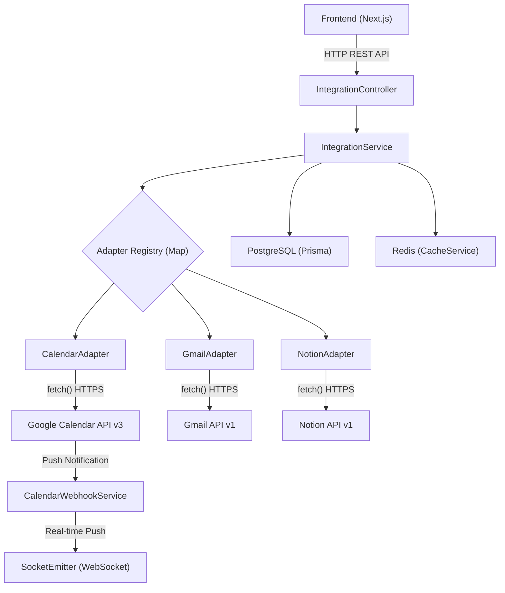
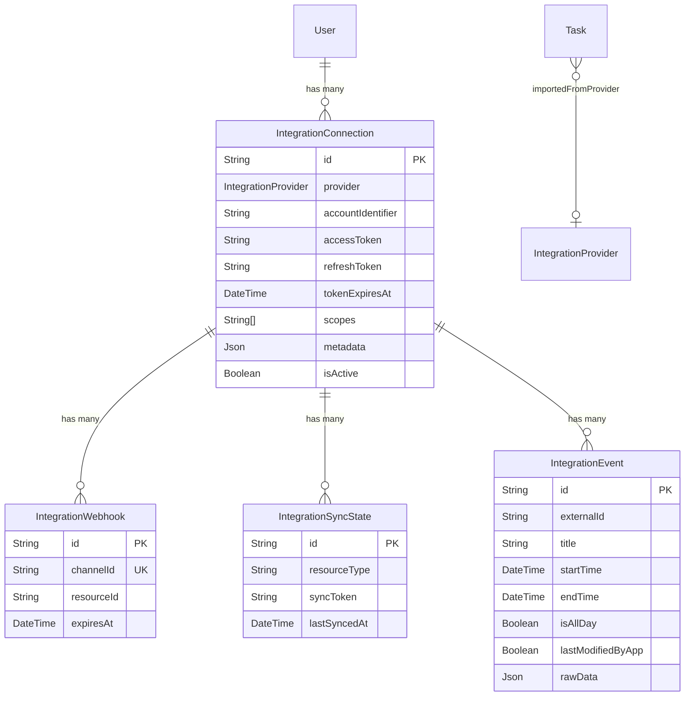
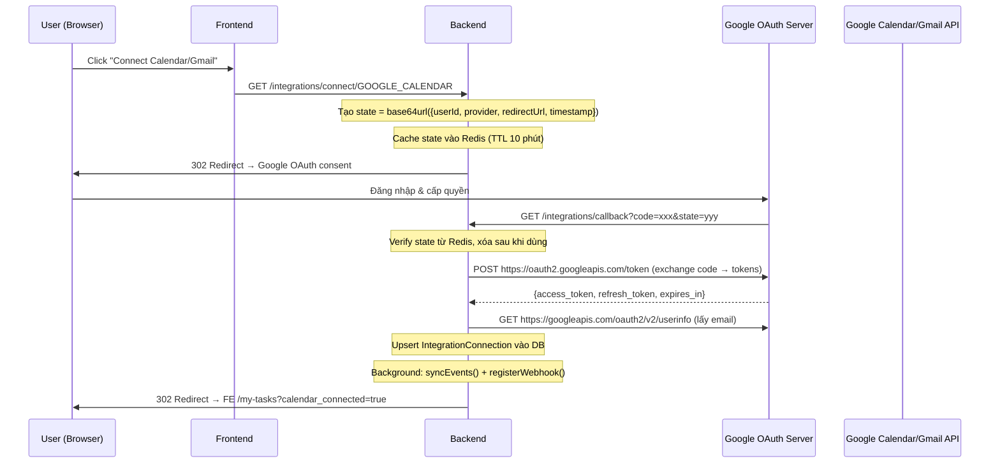
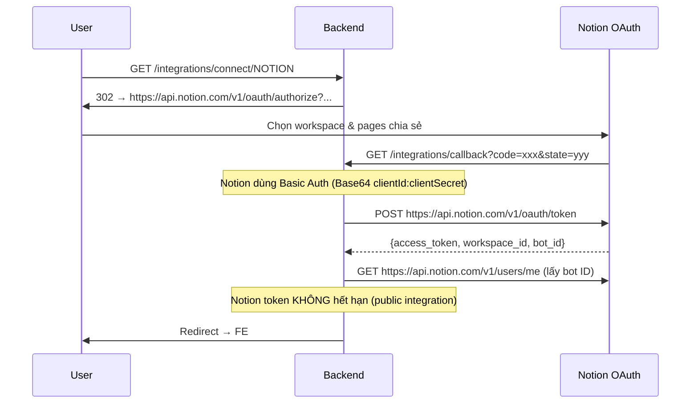
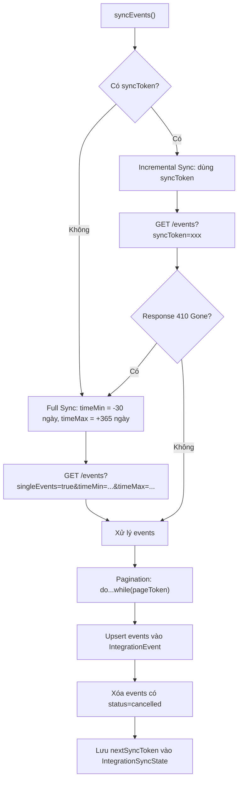
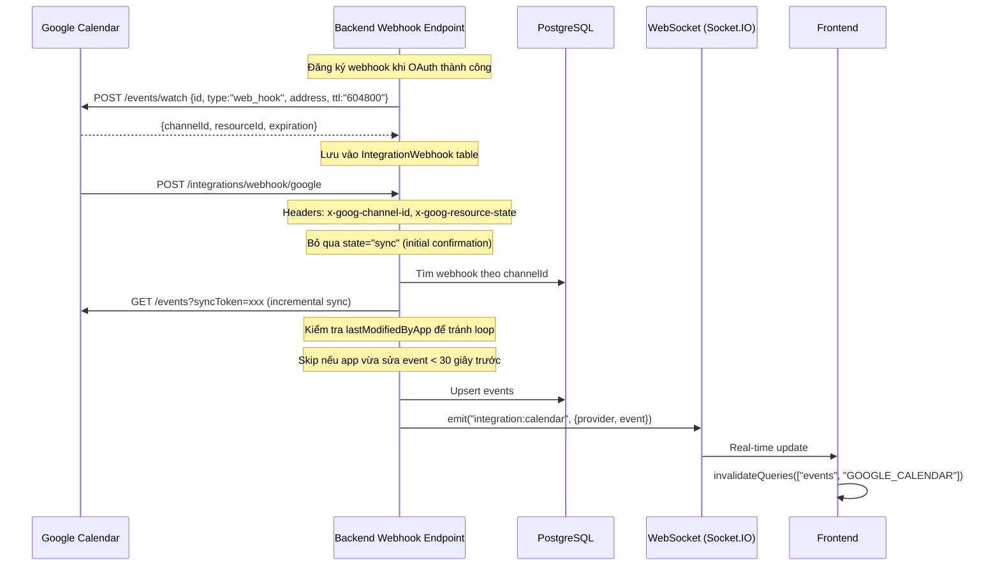
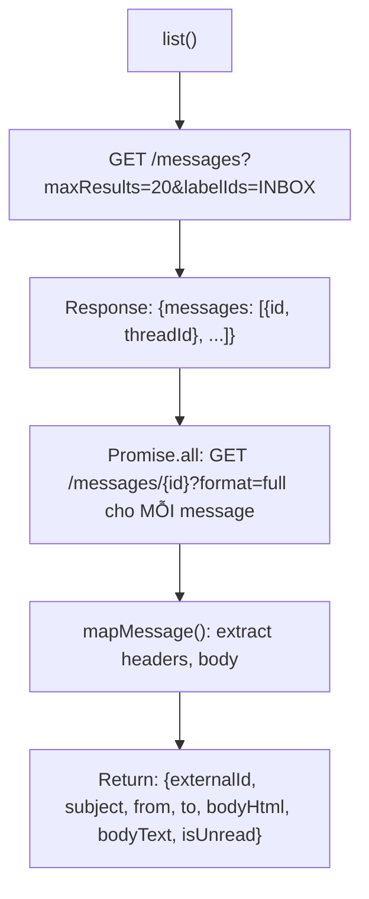
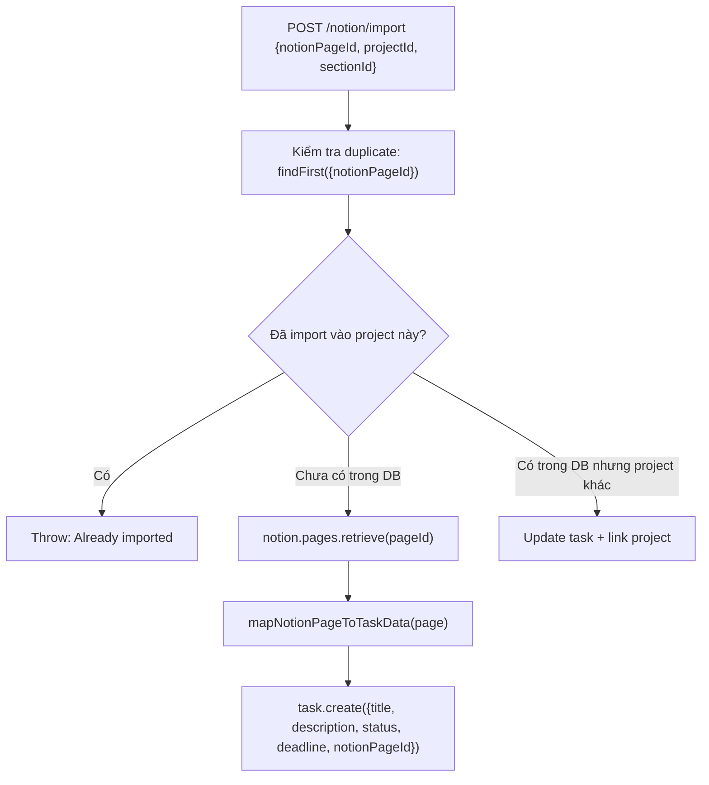
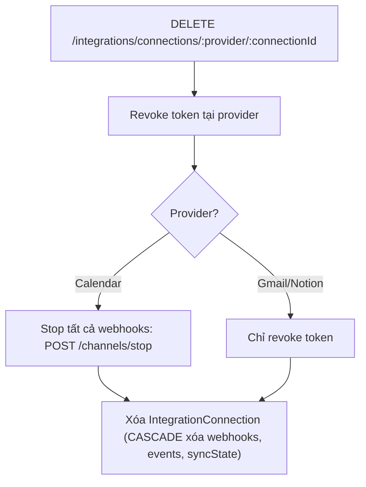

# Phân Tích Chi Tiết Triển Khai Integration: Notion, Gmail, Google Calendar

## 1. Tổng Quan Kiến Trúc

Hệ thống sử dụng **Adapter Pattern** để trừu tượng hóa việc tích hợp với nhiều provider khác nhau.



### Các thành phần chính

| Thành phần | File | Vai trò |
|---|---|---|
| **IntegrationController** | `integration.controller.ts` | REST endpoints cho FE |
| **IntegrationService** | `integration.service.ts` | Business logic, OAuth, CRUD |
| **CalendarAdapter** | `adapters/calendar.adapter.ts` | Gọi Google Calendar API |
| **GmailAdapter** | `adapters/gmail.adapter.ts` | Gọi Gmail API |
| **NotionAdapter** | `adapters/notion.adapter.ts` | Gọi Notion API |
| **NotionService** | `notion/notion.service.ts` | Business logic riêng cho Notion |
| **CalendarWebhookService** | `webhook/calendar.webhook.ts` | Xử lý webhook từ Google |
| **NotionWebhookService** | `webhook/notion.webhook.ts` | Xử lý webhook từ Notion |

### Interface chung – `IIntegrationAdapter`

Tất cả adapter đều implement interface này ([integration.types.ts](file:///c:/study/DATN/BE/src/modules/integration/types/integration.types.ts)):

```typescript
export interface IIntegrationAdapter {
  readonly provider: IntegrationProvider;
  // OAuth
  getAuthUrl(state: string): string;
  exchangeCodeForTokens(code: string): Promise<OAuthTokens>;
  refreshAccessToken(refreshToken: string): Promise<TokenRefreshResult>;
  revokeAccess(accessToken: string): Promise<void>;
  // CRUD
  list(accessToken: string, options: SyncEventOptions | SyncMessageOptions): Promise<any>;
  create(accessToken: string, payload: CreateEventInput | CreateMessageInput): Promise<any>;
  update(accessToken: string, id: string, payload: UpdateEventInput | UpdateMessageInput): Promise<any>;
  delete(accessToken: string, id: string): Promise<void>;
  // Webhook (optional, chỉ Calendar dùng)
  registerWebhook?(accessToken: string, callbackUrl: string, resourceId: string): Promise<WebhookRegistration>;
  stopWebhook?(accessToken: string, channelId: string, resourceId: string): Promise<void>;
}
```

---

## 2. Database Schema (Prisma)



**Unique constraints:**
- `IntegrationConnection`: `@@unique([userId, provider, accountIdentifier])` — mỗi user chỉ có 1 connection cho mỗi account
- `IntegrationEvent`: `@@unique([connectionId, provider, externalId])` — tránh duplicate event

---

## 3. Luồng Kết Nối OAuth 2.0

### 3.1 Google Calendar & Gmail – OAuth 2.0 Authorization Code Flow



**Chi tiết exchange code:**
```typescript
// CalendarAdapter.exchangeCodeForTokens()
const response = await fetch("https://oauth2.googleapis.com/token", {
  method: "POST",
  headers: { "Content-Type": "application/x-www-form-urlencoded" },
  body: new URLSearchParams({
    client_id: this.clientId,
    client_secret: this.clientSecret,
    code,
    grant_type: "authorization_code",
    redirect_uri: this.redirectUrl,
  }),
});
```

**Scopes yêu cầu:**

| Provider | Scopes |
|---|---|
| Calendar | `calendar`, `calendar.events`, `userinfo.email` |
| Gmail | `gmail.readonly`, `gmail.send`, `gmail.modify`, `userinfo.email` |

### 3.2 Notion – OAuth 2.0 (khác biệt)



**Điểm khác biệt so với Google:**

| Đặc điểm | Google | Notion |
|---|---|---|
| Auth header khi exchange | Không (gửi client_secret trong body) | `Basic Base64(clientId:clientSecret)` |
| Content-Type | `application/x-www-form-urlencoded` | `application/json` |
| Token hết hạn | Có (~1h), cần refresh | Không hết hạn |
| Refresh token | Có | Không |
| Account identifier | Email từ `/userinfo` | Bot ID từ `/users/me` |

```typescript
// NotionAdapter.exchangeCodeForTokens()
const credentials = Buffer.from(`${this.clientId}:${this.clientSecret}`).toString("base64");
const response = await fetch("https://api.notion.com/v1/oauth/token", {
  method: "POST",
  headers: {
    Authorization: `Basic ${credentials}`,
    "Content-Type": "application/json",
  },
  body: JSON.stringify({
    grant_type: "authorization_code",
    code,
    redirect_uri: this.redirectUri,
  }),
});
```

### 3.3 Token Management

```typescript
// IntegrationService.getValidAccessToken()
async getValidAccessToken(connection, provider): Promise<string> {
  // Notion: token không hết hạn → trả luôn
  if (provider === IntegrationProvider.NOTION) return connection.accessToken;
  
  // Google: kiểm tra còn hạn không (buffer 5 phút)
  if (connection.tokenExpiresAt > new Date(Date.now() + 5 * 60 * 1000))
    return connection.accessToken;
  
  // Token hết hạn → refresh
  const newTokens = await adapter.refreshAccessToken(connection.refreshToken);
  // Update DB
  await this.prisma.integrationConnection.update({...});
  return newTokens.accessToken;
}
```

---

## 4. Google Calendar Integration – Chi Tiết

### 4.1 API Endpoints (Backend → Google)

| Hành động | Method | Google API URL |
|---|---|---|
| List events | GET | `https://googleapis.com/calendar/v3/calendars/primary/events` |
| Create event | POST | `https://googleapis.com/calendar/v3/calendars/primary/events` |
| Update event | PATCH | `https://googleapis.com/calendar/v3/calendars/primary/events/{id}` |
| Delete event | DELETE | `https://googleapis.com/calendar/v3/calendars/primary/events/{id}` |
| Register webhook | POST | `https://googleapis.com/calendar/v3/calendars/{id}/events/watch` |
| Stop webhook | POST | `https://googleapis.com/calendar/v3/channels/stop` |

### 4.2 Sync Mechanism (Incremental Sync)



**Data mapping Google → Local:**
```typescript
private mapGoogleEvent(event: GoogleEvent): IntegrationCalendarData {
  return {
    externalId: event.id,
    title: event.summary || "(No title)",
    description: event.description,
    startTime: new Date(event.start?.dateTime || event.start?.date),
    endTime: new Date(event.end?.dateTime || event.end?.date),
    isAllDay: !event.start?.dateTime,  // Nếu không có dateTime → all-day
    location: event.location,
    status: event.status,
    rawData: event,
  };
}
```

### 4.3 Webhook – Real-time Sync



**Anti-loop mechanism:**
- Khi app tạo/sửa event → set `lastModifiedByApp = true`
- Khi webhook trigger → kiểm tra flag, nếu `true` && `lastModifiedAt < 30s` → skip
- Sau đó reset flag về `false`

**Cron job gia hạn webhook (mỗi giờ):**
```typescript
@Cron(CronExpression.EVERY_HOUR)
async renewExpiringWebhooks() {
  // Tìm webhook hết hạn trong 1 giờ tới
  // Stop webhook cũ → Xóa record cũ → Đăng ký webhook mới
}
```

### 4.4 REST API cho Frontend

| FE API | BE Endpoint | Method |
|---|---|---|
| `getConnectionsApi("GOOGLE_CALENDAR")` | `GET /integrations/connections/GOOGLE_CALENDAR` | GET |
| `getEventsApi({provider, timeMin, timeMax})` | `GET /integrations/events` | GET |
| `createEventApi(payload)` | `POST /integrations/events` | POST |
| `updateEventApi({provider, externalId, data})` | `PATCH /integrations/events/:provider/:externalId` | PATCH |
| `deleteEventApi(provider, externalId)` | `DELETE /integrations/events/:provider/:externalId` | DELETE |
| `deleteConnectionApi(provider, connectionId)` | `DELETE /integrations/connections/:provider/:connectionId` | DELETE |

---

## 5. Gmail Integration – Chi Tiết

### 5.1 API Endpoints (Backend → Gmail)

| Hành động | Method | Gmail API URL |
|---|---|---|
| List messages | GET | `https://gmail.googleapis.com/gmail/v1/users/me/messages` |
| Get message detail | GET | `https://gmail.googleapis.com/gmail/v1/users/me/messages/{id}?format=full` |
| Send message | POST | `https://gmail.googleapis.com/gmail/v1/users/me/messages/send` |
| Modify labels | POST | `https://gmail.googleapis.com/gmail/v1/users/me/messages/{id}/modify` |
| Delete message | DELETE | `https://gmail.googleapis.com/gmail/v1/users/me/messages/{id}` |

### 5.2 Luồng lấy email



**Gmail body extraction (xử lý MIME multipart):**
```typescript
private extractBodyContent(payload) {
  // Đệ quy duyệt qua parts của email
  // Tìm part có mimeType = "text/html" → bodyHtml
  // Tìm part có mimeType = "text/plain" → bodyText
  // Decode Base64URL → UTF-8
}

private decodeBase64Url(value: string): string {
  const normalized = value.replace(/-/g, "+").replace(/_/g, "/");
  const padding = "=".repeat((4 - (normalized.length % 4)) % 4);
  return Buffer.from(normalized + padding, "base64").toString("utf8");
}
```

### 5.3 Gửi email (MIME encoding)

```typescript
// Tạo MIME message
private buildMime(payload: CreateMessageInput): string {
  return [
    `To: ${payload.to.join(", ")}`,
    ...(payload.cc?.length ? [`Cc: ${payload.cc.join(", ")}`] : []),
    `Subject: ${payload.subject}`,
    "MIME-Version: 1.0",
    `Content-Type: ${payload.bodyHtml ? "text/html" : "text/plain"}; charset=UTF-8`,
    "",
    payload.bodyHtml || payload.bodyText || "",
  ].join("\r\n");
}

// Encode sang Base64URL rồi gửi
const raw = this.toBase64Url(this.buildMime(payload));
await fetch("https://gmail.googleapis.com/gmail/v1/users/me/messages/send", {
  method: "POST",
  headers: { Authorization: `Bearer ${accessToken}`, "Content-Type": "application/json" },
  body: JSON.stringify({ raw, threadId: payload.threadId }),
});
```

### 5.4 Mark as read

```typescript
// Xóa label "UNREAD" khỏi message
const message = await adapter.update(accessToken, externalId, {
  removeLabelIds: ["UNREAD"],
});
```

---

## 6. Notion Integration – Chi Tiết

### 6.1 Hai module xử lý Notion

| Module | Vai trò |
|---|---|
| `NotionAdapter` (trong integration) | OAuth, token management |
| `NotionService` + `NotionController` (module riêng) | Business logic: search, import, CRUD pages |

**NotionService sử dụng SDK `@notionhq/client`** (khác Calendar/Gmail dùng raw `fetch()`):
```typescript
private async getNotionClientForUser(userId: string): Promise<Client> {
  const connections = await this.integrationService.getConnections(userId, IntegrationProvider.NOTION);
  const connection = await this.integrationService.getConnection(userId, IntegrationProvider.NOTION, connectionId);
  const accessToken = await this.integrationService.getValidAccessToken(connection, IntegrationProvider.NOTION);
  return new Client({ auth: accessToken }); // @notionhq/client SDK
}
```

### 6.2 API Endpoints

| FE API | BE Endpoint | Method | Notion API |
|---|---|---|---|
| `searchNotionDatabasesApi(query)` | `GET /notion/databases` | GET | `notion.search({query})` |
| `getNotionDatabaseTasksApi(dbId)` | `GET /notion/databases/:id/tasks` | GET | `notion.dataSources.query()` |
| `importNotionTaskApi(payload)` | `POST /notion/import` | POST | `notion.pages.retrieve()` |
| `getNotionPagesApi()` | `GET /notion/pages` | GET | `notion.search({filter: "page"})` |
| `getNotionPageDetailsApi(pageId)` | `GET /notion/pages/:id` | GET | `notion.pages.retrieve()` + enrich |
| `updateNotionPagePropertyApi(pageId)` | `PATCH /notion/pages/:id/properties` | PATCH | `notion.pages.update()` |
| `createNotionDatabaseApi(payload)` | `POST /notion/databases` | POST | `notion.databases.create()` |
| `createNotionPageApi(payload)` | `POST /notion/pages` | POST | `notion.pages.create()` |

### 6.3 Import Notion Task → PlanWise Task



**Property mapping logic:**
```typescript
mapNotionPageToTaskData(page) {
  // title → prop.type === "title" → ghép plain_text
  // description → prop.type === "rich_text" → ghép plain_text
  // status → prop.type === "status" hoặc "select":
  //   - "done"/"hoàn thành" → DONE
  //   - "progress"/"đang làm" → DOING
  //   - "cancel"/"hủy" → CANCELLED
  //   - mặc định → TODO
  // deadline → prop.type === "date" → prop.date.end || prop.date.start
}
```

### 6.4 Bidirectional Sync (PlanWise ↔ Notion)

**PlanWise → Notion** (khi user update task trong PlanWise):
```typescript
async syncTaskToNotion(userId, notionPageId, taskData) {
  const page = await notion.pages.retrieve({page_id: notionPageId});
  const properties = {};
  // Duyệt qua page.properties, match theo TYPE:
  // - type "title" → cập nhật title
  // - type "rich_text" → cập nhật description
  // - type "date" → cập nhật deadline
  await notion.pages.update({page_id: notionPageId, properties});
}
```

**Notion → PlanWise** (webhook):
```typescript
// NotionWebhookService.handleNotionWebhook()
// 1. Nhận payload {type, workspace_id, entity: {type: "page", id}}
// 2. Tìm connections theo workspace_id trong metadata
// 3. Fetch fresh page data từ Notion API
// 4. mapNotionPageToTaskData() 
// 5. Update task trong DB
// 6. Emit socket event "task:updated" cho FE
```

### 6.5 Page Detail Enrichment

Khi lấy chi tiết trang Notion, hệ thống **enrich options** cho select/status/multi_select:
```typescript
// Lấy database schema để biết options có sẵn
const db = await notion.databases.retrieve({database_id: databaseId});
// Với mỗi property type select/status/multi_select:
// Inject options từ DB schema vào page.properties
// → FE có thể render dropdown với đầy đủ options
```

### 6.6 Update Property (Dynamic)

```typescript
async updatePageProperty(userId, pageId, propertyId, value, type) {
  switch (type) {
    case "status":  → {status: {name: value}}
    case "select":  → {select: {name: value}} hoặc {select: null}
    case "multi_select": → {multi_select: [{name: v1}, {name: v2}]}
    case "date":    → {date: {start: ISO string}} hoặc {date: null}
    case "rich_text": → {rich_text: [{text: {content: value}}]}
    case "title":   → {title: [{text: {content: value}}]}
    case "checkbox": → {checkbox: boolean}
    case "number":  → {number: Number(value)}
  }
  await notion.pages.update({page_id: pageId, properties});
}
```

---

## 7. Environment Variables

```
# Google Calendar
GOOGLE_CALENDAR_CLIENT_ID="1051519365037-..."
GOOGLE_CALENDAR_CLIENT_SECRET="GOCSPX-..."
GOOGLE_CALENDAR_REDIRECT_URL="http://localhost:8080/integrations/callback"

# Gmail  
GOOGLE_GMAIL_CLIENT_ID="1051519365037-..."
GOOGLE_GMAIL_CLIENT_SECRET="GOCSPX-..."
GOOGLE_GMAIL_REDIRECT_URL="http://localhost:8080/integrations/callback"

# Notion
NOTION_CLIENT_ID="357d872b-..."
NOTION_CLIENT_SECRET="secret_9eHe..."
NOTION_CALLBACK_URL="https://api.planwise.id.vn/integrations/callback"

# Chung
INTEGRATION_SUCCESS_REDIRECT_URL="http://localhost:3000"
WEBHOOK_BASE_URL=https://be.planwise.id.vn
```

> [!IMPORTANT]
> Google Calendar và Gmail dùng **cùng redirect URL** (`/integrations/callback`) nhưng **khác OAuth client** (client_id/secret riêng). State parameter chứa provider để phân biệt.

---

## 8. Tổng Kết So Sánh 3 Provider

| Đặc điểm | Google Calendar | Gmail | Notion |
|---|---|---|---|
| **Giao thức** | OAuth 2.0 + REST | OAuth 2.0 + REST | OAuth 2.0 + REST |
| **HTTP Client** | Native `fetch()` | Native `fetch()` | `@notionhq/client` SDK |
| **Auth Header** | `Bearer {access_token}` | `Bearer {access_token}` | `Bearer {access_token}` |
| **Token Expiry** | ~1 giờ | ~1 giờ | Không hết hạn |
| **Refresh Token** | Có | Có | Không |
| **Webhook** | Google Push Notification | Chưa triển khai | Có (xử lý page updates) |
| **Real-time FE** | Socket.IO event | Không | Socket.IO event |
| **Local Cache** | IntegrationEvent table | Không cache (fetch trực tiếp) | Task table (import) |
| **Sync Strategy** | Incremental (syncToken) | On-demand (mỗi lần gọi) | Manual import + webhook |
| **Data Format** | JSON | MIME (Base64URL encoded) | JSON |
| **Notion-Version Header** | Không | Không | `2022-06-28` |

---

## 9. Luồng Disconnect



---

## 10. Frontend Socket Subscriber

```typescript
// FE lắng nghe real-time calendar updates
export function handleNewCalendarEvent(socket: Socket, queryClient: QueryClient) {
  const handler = () => {
    queryClient.invalidateQueries({ queryKey: ["events", "GOOGLE_CALENDAR"] });
  };
  socket.on("integration:calendar", handler);
  return () => { socket.off("integration:calendar", handler); };
}
```

Khi nhận event `integration:calendar` từ WebSocket → React Query tự động refetch data → UI cập nhật tức thì.
